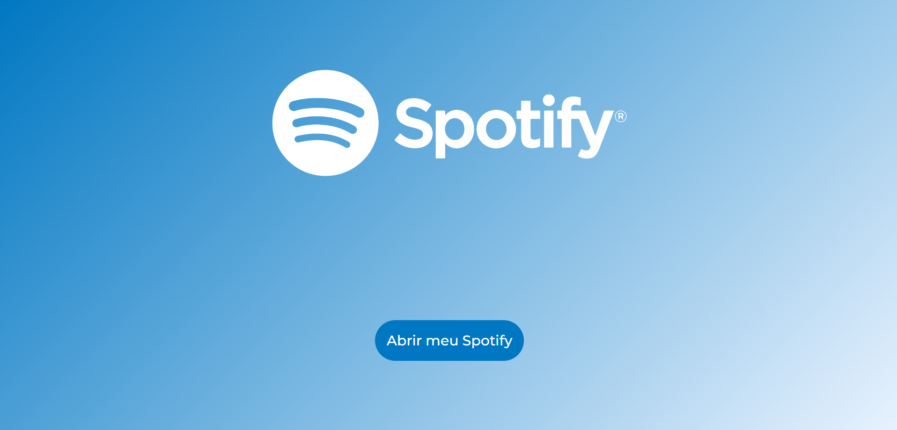
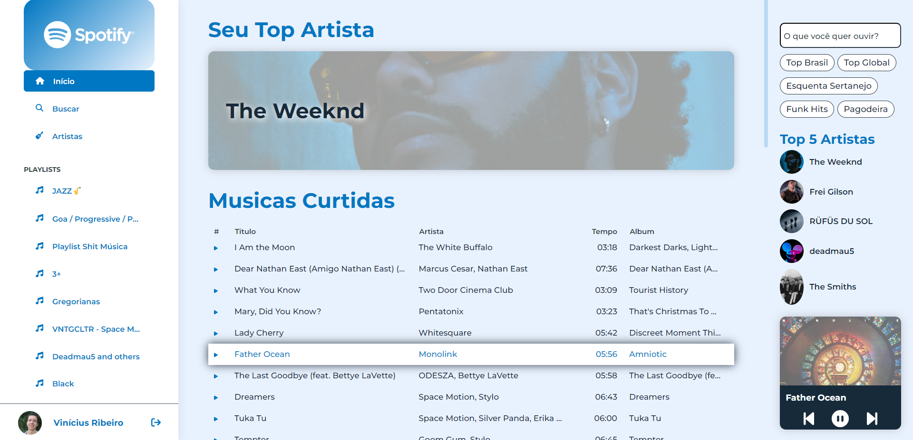

## Clone do Spotify e Redesing com Angular

Essse projeto foi feito acompanhando uma [serie de videos](https://www.youtube.com/playlist?list=PLMFE0Mu3BVy63bmSR92QbTR_rU576VOxg) ministradas por [Cristian William](https://github.com/cristianWilliam/Spotify-Angular) em seu canal no [Youtube](https://www.youtube.com/channel/UC5XGkx6CoGC5HsJ3INJBKXg).

O projeto busca exploxar os recursos do framework [Angular](https://github.com/angular/angular), abordando conceitos relacionados como [SCSS](https://sass-lang.com/), [Typescript](https://www.typescriptlang.org/) e utlização da API do [Spotify](https://www.spotify.com/br/) para obtenção de dados.

<h2>‼️Importante</h2>
<ul>
  <li>Nescessario ter um conta premium do Spotify para poder usar todos os recursos</li>
  <li>É nescessario ter o seu propio Client ID do spotify e colocar ele nos 2 arquivos de environmment</li>
</ul>

<h2>Sobre o projeto: </h2>

• Feito em [Angular CLI](https://github.com/angular/angular-cli) versão 14.2.7.

<h2>Resultados: </h2>
<h3>Tela de login: </h3>



<h3>Tela Inicial: </h3>




## 💾Instalação
Abra um pasta e faça um clone do projeto em sua maquina

```
    git clone git@github.com:Viniciusrbr/Angular-Spotify-Clone-Redesing.git
```

ou

```
    git clone https://github.com/Viniciusrbr/Angular-Spotify-Clone-Redesing.git
```

## ▶️Execução do Projeto
Depois de ter o projeto clonado, instale as dependências do Node:

```
    npm install
```
Em seguida execute o seguinte comando:

```
    ng serve 
```

Depois acesse a aplicação através do endereço http://localhost:4200
